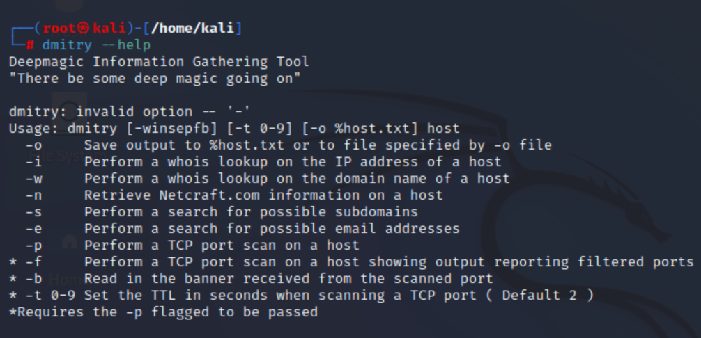

# SEC: Information Gathering
## Online Tools
- [Security Trails](https://securitytrails.com/)
- [Shodan](https://www.shodan.io/)

## Social Media and Dictionaries
### 1. Custom Word List generator (CeWL)
CeWL spiders a given URL, up to a specified depth, and returns a list of words which can then be used for password crackers. 

`cewl -m 8 -e --email_file ./emails.txt -d 0 -w ./diccio https://twitter.com/hackbysecurity?lang=es`

### 2. Common User Passwords Profiler (CUPP)
Generate commmon passwords dictionaries based on personal information from the target. You can also import and mutate existing dictionaries.

`python3 cupp.py -i`

Download from source: [cupp](https://github.com/Mebus/cupp.git)

### 3. The Harvester
Configure API Keys:
`nano /etc/theHarvester/api-keys.yaml`

Run command:
`theHarvester -d hackbysecurity.com -s -b google -n -f ./report`

- `--dns-lookup`: check to which IP address corresponds the domain name and will look at the range of IP addresses if there are subdomains.
Direct and inverse domain resolutions

### 4. Dmitry
Perform whois, subdomaind and mails search.
`dmitry -w hackbysecurity.com -n -s -e`

Avoid port scanning without permissions.